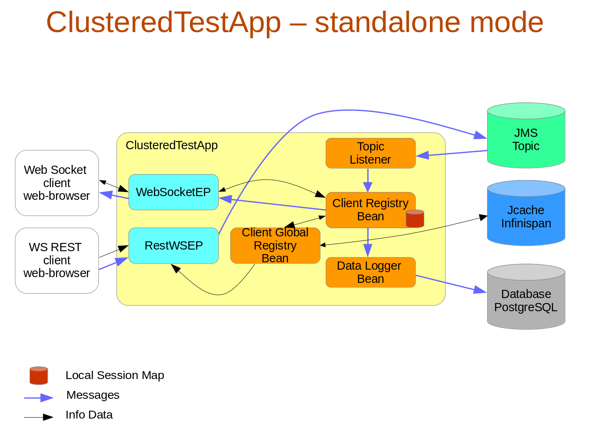
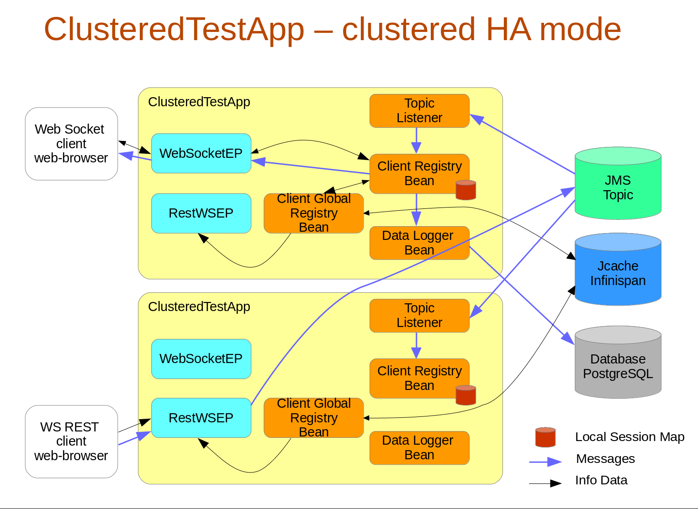

Clustered Application
=====================

This demo application demostrates clustering capabilities of WildFly AS.
Application is able to run on standalone WildFly server as well. 
WildFy 9.0.1 or later is required
Deploy and go to URL http://localhost:8080/ClusteredTestApp

Application utilizes following WildFly subsystems:
CDI, EJB, JPA, Servlets, WebSockets, Infinispan (JCache), JMS 

Standalone Mode
---------------
In order to run on WildFly in standalone mode, add [snippets](src/main/resources/standalone-full.xml.snippet) into standalone-full.xml

                                            
Clustered mode
--------------
In order to run on WildFly in cluster, add [snippets](src/main/resources/standalone-full-ha.xml.snippet) into standalone-full-ha.xml mode

